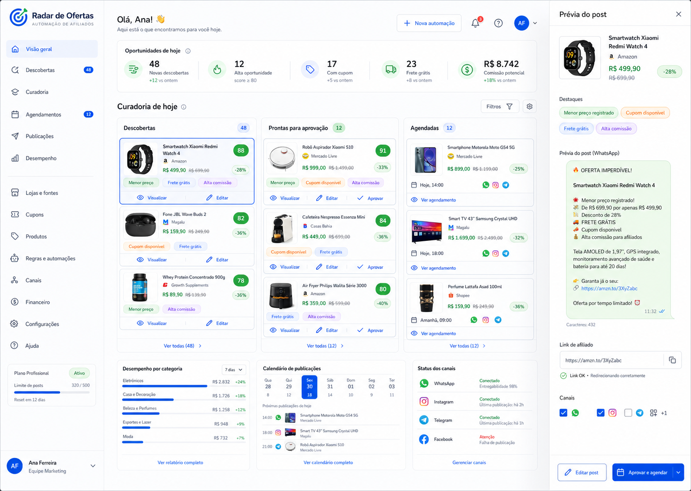

# Radar de Ofertas

Pacote de design e handoff da plataforma de curadoria, aprovacao e publicacao
de ofertas de afiliados.

## Direcao escolhida

**Editorial Inteligente + Radar Calmo**

- O fluxo principal e curar, revisar, editar, aprovar e agendar.
- Metricas apoiam decisoes, mas nunca dominam a primeira dobra.
- Tema claro e a experiencia principal; tema escuro e complementar.
- Glassmorphism aparece somente em superficies temporarias e destaques.
- A interface usa bastante respiro, tipografia legivel e poucas elevacoes.

## Documentacao

### Produto

- [Visao do produto e fluxos](docs/product/01-product-ux.md)
- [Design system](docs/product/02-design-system.md)
- [Telas e responsividade](docs/product/03-screens.md)
- [Estados, permissoes e conteudo](docs/product/04-states-permissions-content.md)
- [Handoff de desenvolvimento](docs/product/05-development-handoff.md)

### Arquitetura

- [Indice de arquitetura](docs/architecture/README.md)
- [Especificacao tecnica](docs/architecture/TECHNICAL_SPEC.md)
- [Modelo de dados](docs/architecture/DATABASE_SCHEMA.md)
- [Supabase RLS](docs/architecture/SUPABASE_RLS.md)
- [Contratos de API](docs/architecture/API_CONTRACTS.md)
- [Integracoes](docs/architecture/INTEGRATIONS.md)
- [Jobs e automacoes](docs/architecture/JOBS_AND_AUTOMATIONS.md)
- [Plano de testes](docs/architecture/TEST_PLAN.md)
- [Backlog MVP](docs/architecture/MVP_BACKLOG.md)
- [Plano executavel da Fase 1](docs/architecture/PHASE_1_IMPLEMENTATION_PLAN.md)
- [Modelo de identidade da Fase 1](docs/architecture/IDENTITY_MODEL.md)
- [Estrategia RLS da Fase 1](docs/architecture/RLS_STRATEGY.md)
- [Plano de migrations da Fase 1](docs/architecture/MIGRATION_PLAN.md)
- [Estrategia de seed da Fase 1](docs/architecture/SEED_STRATEGY.md)
- [Matriz de testes da Fase 1](docs/architecture/PHASE_1_TEST_MATRIX.md)

### Spikes

- [Telegram](docs/spikes/TELEGRAM_SPIKE.md)
- [Mercado Livre](docs/spikes/MERCADO_LIVRE_SPIKE.md)
- [Shopee](docs/spikes/SHOPEE_SPIKE.md)
- [Estrategia de captura](docs/spikes/CAPTURE_STRATEGY.md)
- [Decisao de scheduler](docs/spikes/SCHEDULER_DECISION.md)

### Decisoes

- [ADR: Viewer interno vs Public Visitor](docs/decisions/ADR_VIEWER_VS_PUBLIC_VISITOR.md)
- [Decisoes da Fase 0](docs/decisions/PHASE_0_DECISIONS.md)
- [Registro de riscos do MVP](docs/decisions/MVP_RISK_REGISTER.md)

### Assets

- [Design tokens](docs/assets/design-tokens.json)
- [Conceito Editorial Inteligente](docs/assets/editorial-inteligente-concept.png)

## Prioridade de implementacao

1. Shell autenticado, permissoes e tokens.
2. Ofertas, detalhe e fila de aprovacao.
3. Editor de post, preview e agendamento.
4. Canais, logs e integracoes.
5. Relatorios e administracao.
