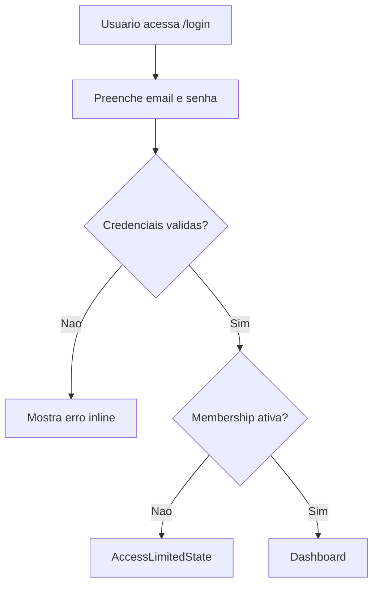
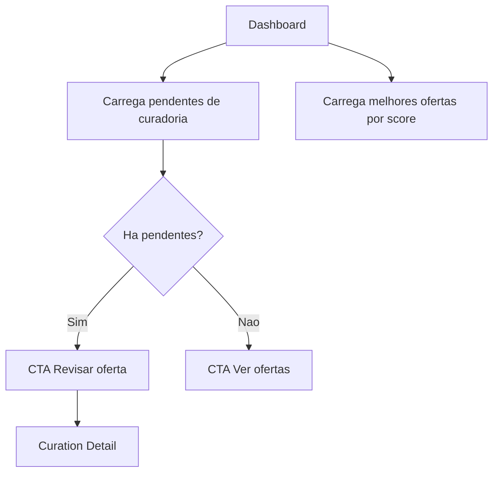
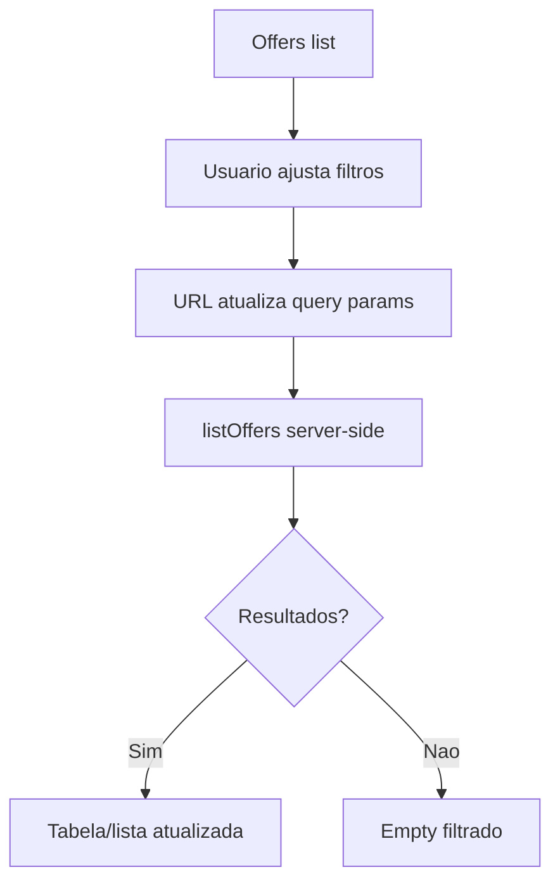
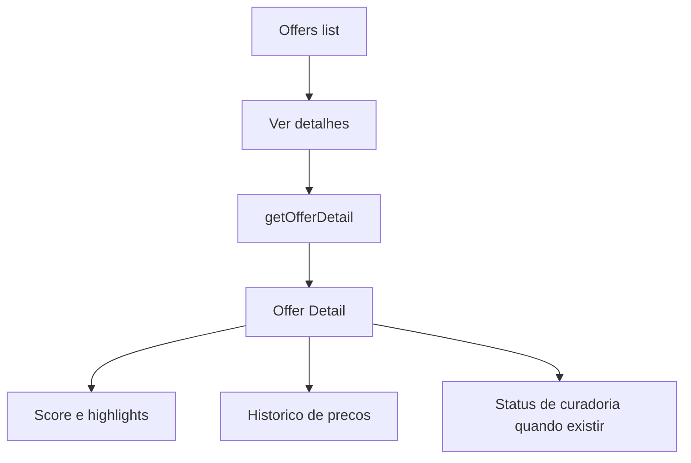
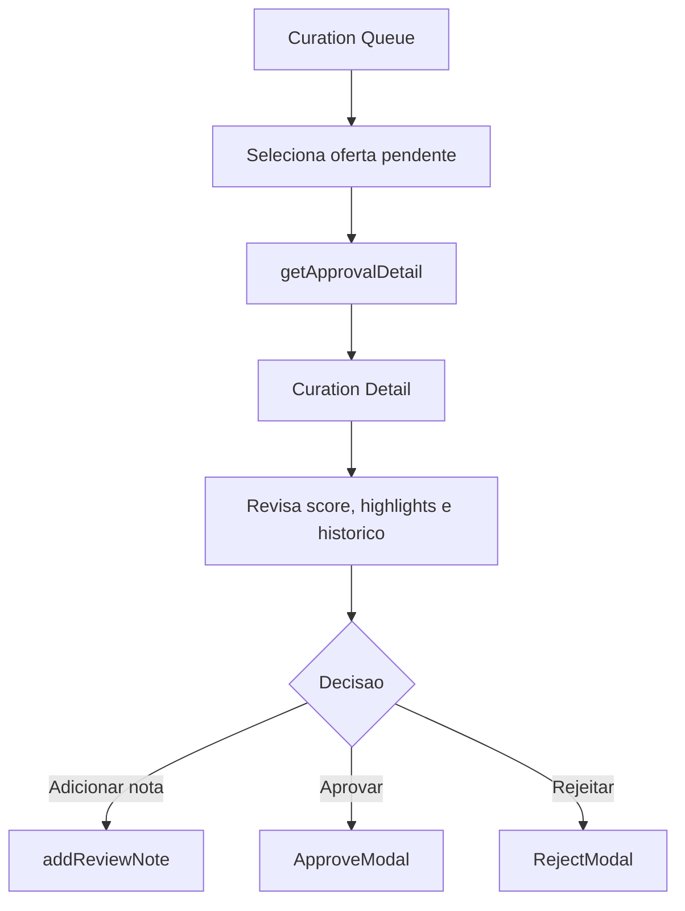
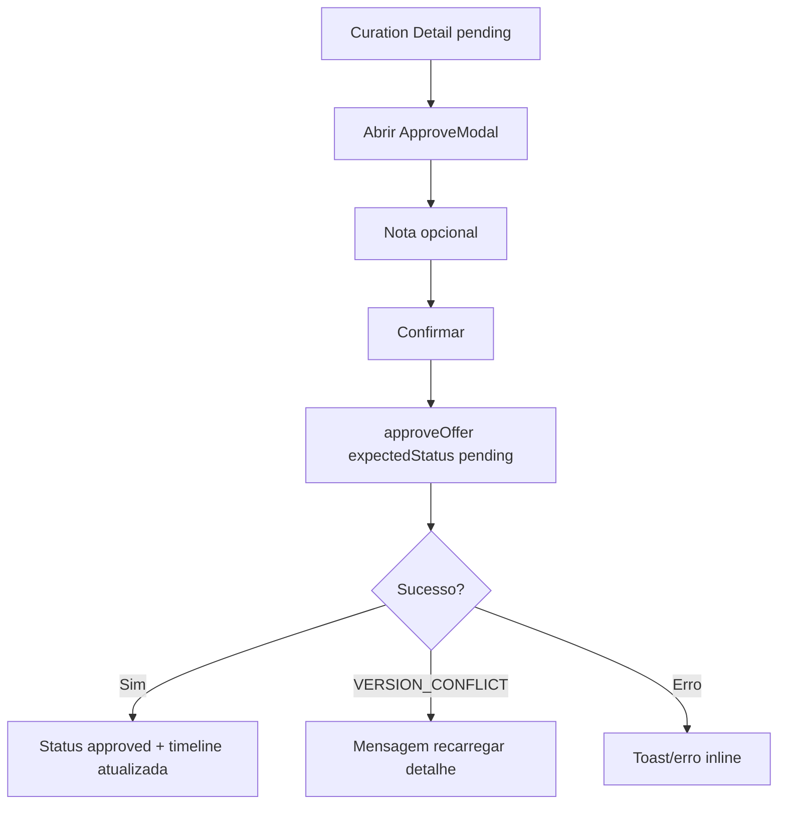
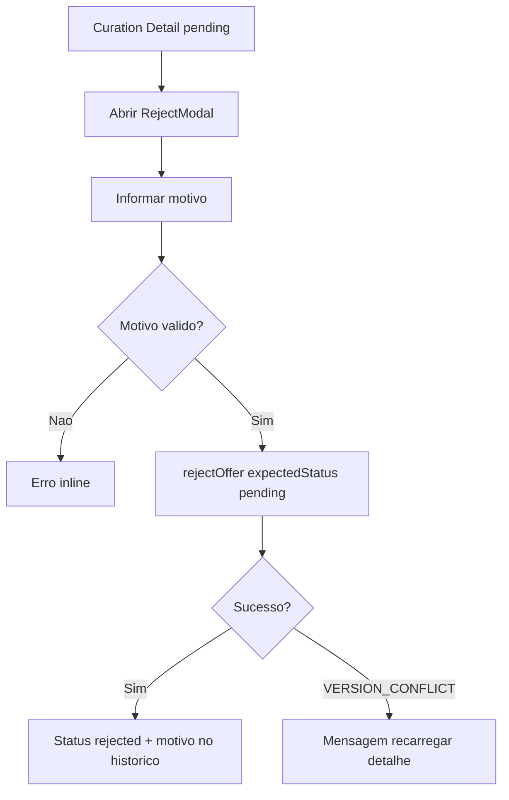
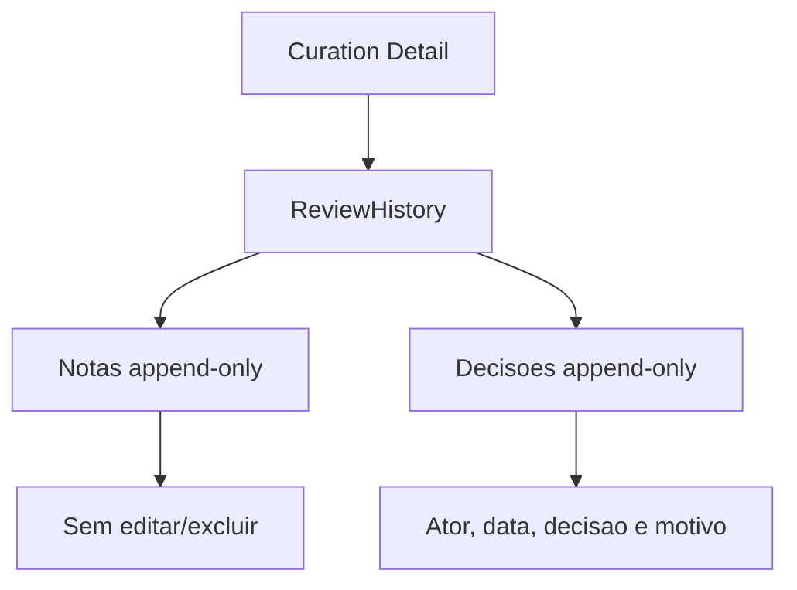
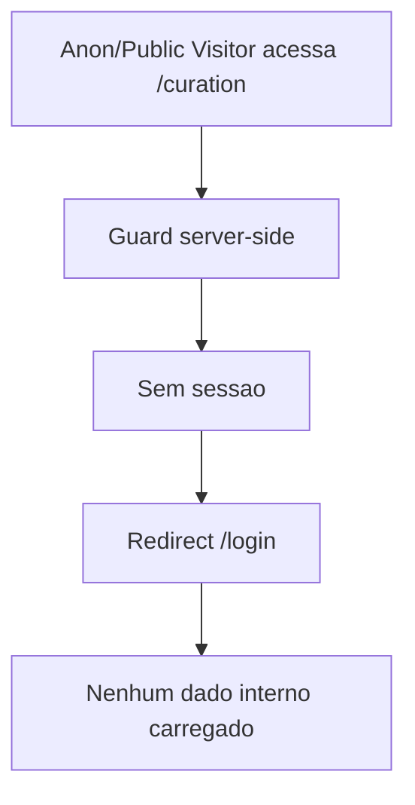

# Fluxos de Usuario da Fase 4

Status: fluxos para primeira UI navegavel.

## Fluxo 1 - Login

## Fluxo 2 - Dashboard para melhor acao

## Fluxo 3 - Filtrar ofertas

## Fluxo 4 - Abrir detalhe da oferta

## Fluxo 5 - Curadoria pendente

## Fluxo 6 - Aprovar

## Fluxo 7 - Rejeitar

## Fluxo 8 - Historico

## Fluxo 9 - Public Visitor tenta rota interna

## Decisoes de fluxo

- Aprovacao nao publica.
- Rejeicao nao apaga oferta.
- Nota nao muda status.
- Historico e leitura, nao edicao.
- Filtros ficam na URL.
